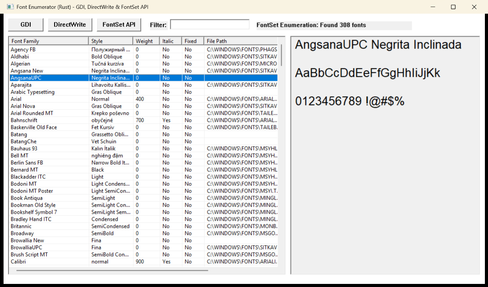

# Font Enumerator (Rust)

A Windows desktop application for exploring system fonts, written in Rust using the `windows` crate.



## Features

- **Three enumeration methods:**
  - **GDI** - Legacy API, available on all Windows versions
  - **DirectWrite** - Modern API with better Unicode support
  - **FontSet API** - Windows 10+ with variable font axis information

- **Font information displayed:**
  - Font family and style names
  - Weight (100-900)
  - Italic/Oblique flag
  - Fixed-pitch (monospace) indicator
  - File path (FontSet API only)
  - Variable font axes (FontSet API only)

- **Interactive features:**
  - Real-time filter/search
  - Font preview panel showing selected font with actual weight and style
  - Resizable window with responsive layout

## Building

### Prerequisites

- Rust 1.70+ with the `x86_64-pc-windows-msvc` target
- Windows 10 SDK

### Build

```bash
cargo build --release
```

The executable will be at `target/release/fontenum.exe`.

## Architecture

The application follows a typical Win32 GUI structure:

```
src/main.rs
├── Constants & Data Structures
│   ├── Control IDs (IDC_*)
│   ├── FontInfo struct
│   ├── AppState struct
│   └── EnumMode enum
├── Entry Point (main)
├── Window Procedure (wnd_proc)
│   ├── WM_CREATE → create_controls
│   ├── WM_SIZE → resize_controls
│   ├── WM_COMMAND → button/edit handlers
│   └── WM_NOTIFY → ListView selection
├── Font Enumeration
│   ├── enumerate_gdi_fonts
│   ├── enumerate_directwrite_fonts
│   └── enumerate_fontset_fonts
└── UI Helpers
    ├── apply_filter
    ├── populate_list_view
    └── update_status_text
```

## License

MIT License - see [LICENSE](LICENSE) for details.
